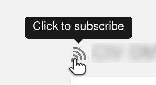
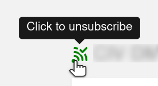

# User Workflows and Documentation - Draft

Welcome to ANET! We hope you’re finding it easy to use. In the information below, we describe a
little bit about how the system works, and some of the major uses cases for this software. If you do
need help, you can read below to see if there are instructions for what you’re trying to do. If your
question still isn’t answered, please email the system administrator at [BLANK].

## Getting Started in ANET

### What is the Advisor Network (ANET)?

ANET is an online tool designed to aid the Resolute Support mission to train, advise, and assist
(TAA) the Afghan government. It does this by giving advisors an easy way to record the outcomes of
their engagements, and share that information across the mission as needed. ANET’s advanced search
capabilities make it easy for advising organizations and mission leadership to gain context on
engagements which can shape future decision making.

### Sensitive information and Authorization Groups

In general, almost all information in ANET is accessible to all fully authenticated users. However,
in some places, ANET can record sensitive information. This comes in two different flavors:

1. sensitive information text as part of engagement reports
1. custom sensitive information fields for e.g. people, as defined in the ANET dictionary
   (configuration)

For both flavors, access to the sensitive information is first and foremost restricted to people
holding active positions in the chosen authorization groups. For engagement reports, authors are
allowed to select these authorization groups themselves. For the custom sensitive information
fields, the authorization groups that have access are defined in the ANET configuration, by the
application administrator.

In addition to people in the authorization groups, sensitive information in engagement reports is
also accessible to the report's author(s). And sensitive information for people or positions is also
accessible to those people's or position's counterparts.

Administrators define the available authorization groups, and who is in them. These groups should
have a descriptive name, so report authors know which ones to choose. Also, administrators have
access to all information.

### Using ANET for the first time

#### Accessing ANET

To log in for the first time, you’ll need to log onto a computer with access Afghan Mission Network.
When you’ve done that, open up a web browser and go to the ANET webpage. Then you’ll be able to use
the Advisor Network (ANET).

ANET logs you in with your existing credentials, so as long as you can log into your computer, you
should be able to access ANET and already be logged in to your account.

#### Checking your information

The first time you visit, you’ll first be taken to a page that shows your profile information.
Please make sure that your name (in canonical form: LAST NAME, First name(s)), rank, position, and
other information is correct. You’ll need be associated with a position in order to see your
organization’s reports and have your reports approved by your Super User.

You can add a position to your profile by typing the position into the field next to the word
“Position”. As you type, we’ll search the existing positions to find what you’re typing in. If we
don’t find your position, you’ll need to ask your Super User to create the position for you. Your
Super User can also add you to a position once they’ve created the position.

After this information is up to date, you’re ready to use ANET.

## Workflows for Advisors

*These workflows are the ones that will be most helpful for advisors. Super Users and Administrators
are also able to complete these workflows.*

### Drafting and Submitting Reports

You have a couple of options for when you create your reports. If you create a draft report before
your engagement, you can set a future date and find that report listed as one of your future
engagements. If you create a report after the fact, you can submit the entire report to your
approval chain all at once.

Here’s how you draft and submit a report; please note that the label for each of the report fields
may differ slightly from what is listed here, some labels or terms may be redefined by the ANET
administrator.

1. From the home page, find the “New Report” button. It’ll be towards the top right of the page. If
   you’re a Super User or Administrator, you’ll need to click onto the “Create” button and select
   “New Report” from the options.
1. This button will take you to a page called “Create a new report”. You’ll enter information in the
   fields on the page. Some fields are required, while others (like Tasks) are optional.
1. Meeting Goal: First, fill out what the goal of the meeting was. This field will be used to
   populate the executive summary used in the daily rollup, so it’s best to complete the sentence
   “The goal of the is meeting is/was to”. You have 250 characters for that.
1. Engagement date: Next you’ll select the engagement date. When you click into the field, a
   calendar will display showing the current month. You can press the “today” button at the bottom
   to easily select the current day, or select another date. Depending on the configuration of ANET,
   you may also be able to select the meeting time.
1. Duration (minutes): Depending on the configuration of ANET, this field may or may not be shown.
   If it is there, it allows you to fill in the duration of the meeting, e.g. 90 for a meeting that
   lasted an hour and a half.
1. Location: As you being to type the location where the engagement happened, results that match
   what you’ve typed will begin to appear. You can keep typing, or select one of the options from
   the dropdown. If what you’ve entered has no matches, the box will turn red. If you’ve typed in
   your location properly and it does not appear, ask your Super User to add that location to ANET.
1. Cancelled engagements: If your engagement was cancelled, select the checkbox next to “This
   engagement was cancelled”. When you select that option, you’ll be prompted to select the reason
   for why the engagement was cancelled. Some fields on the form will no longer be visible. You’ll
   only need to fill out “People involved in this engagement” and next steps after this point. You
   can add detailed comments if you’d like.
1. Atmospherics: You can record the engagement’s atmosphere, by selecting Positive, Neutral or
   Negative. If you select either Neutral or Negative, you’ll be required to add details explaining
   why it was not positive (for Positive, these details are optional).
1. People involved in this engagement: In this section, you can add the advisors and principals who
   attended your engagements. By default, you will be listed as the primary attendee and author in
   this section. People you have added in recent reports will appear in the “Recent attendees”
   section on the right-hand side of Attendees. To add one of them, just click on their name. For
   others, start typing their name into the text field next to “Attendees” and select their name
   from among the results. If you don’t see the person you are trying to add, ask your Super User to
   add them to ANET. In this section, you can also select who the primary advisor and principal in
   the meeting were. By default, the first advisor and principal added will be selected as the
   primary. To select someone else, just click the circle to the left of their *Primary* label. A
   report can also have multiple authors. By default you will be the sole author (and you can't
   remove yourself from the author list). Click the checkbox in the authors column for advisors you
   want to make additional authors.
1. Tasks: If your meeting related to one of your advising organization’s Tasks, you must select it
   by searching for it in the text field to the right of “Tasks” or by clicking a task under the
   “Recent Tasks”.
1. Key outcomes: In the field next to “Key outcomes”, you have 250 characters to provide a summary
   of the most important points of the engagement. This will appear in your report’s executive
   summary, so make sure it’s the most impactful information for leadership and other advisors to
   see.
1. Next Steps: In the next steps field, you have 250 characters to describe the next steps you’ll
   be taking on this issue or with this principal. This will appear in the executive summary.
1. Key details: In this text field you should write up a detailed report. You can use mark-up, like
   adding three-level headers, lists, boldface fonts, etc. You can also link to other objects in the
   ANET database by linking to them via the *ANET Link* option.
1. Sensitive information: If you need to record sensitive information related to this engagement,
   click the *Add sensitive information* button. Another (mark-up enabled) text field will appear
   that will hold the sensitive information, together with a list of Authorization Groups that you
   must add to record who is allowed to access the sensitive information. If you're unsure which
   authorization groups you should add, ask your supervisor or administrator for guidance. The
   sensitive information you add here will be visible to you and other report authors you may have
   added, to people in the authorization group(s) that you select, and to administrators.
1. Saving your report: To save the draft version of the report, you can click on the “Preview and
   submit” button at the top, or very bottom, of the page. This will create a draft of your report,
   and take you to a page that shows a preview of the report, and, if complete, allows you to submit
   the report for approval. You can click the save button at any time to hold onto the work you’ve
   already completed (note that there's also an automatic save every 30 seconds). On the preview
   page, you can view what your report will look like and see if there are any required fields that
   you still need to fill out. If you’d like to edit your saved draft, click on the “Edit” button at
   the top of the page. You’ll be able to edit and re-save your report.
1. Submitting your report: When you’re happy with your draft report and are ready to submit it, you
   can click on the “Submit report” button. This will send the report to the first person(s) in your
   approval chain.
1. Viewing your approvers: After you’ve submitted your report, it goes to the first person in your
   advising organization’s approval chain. You can see who needs to approve your report while
   viewing that report. By scrolling down to the section called “Workflow”, you can see each
   approval step in your organization. By clicking on each step, you can see the individuals who can
   approve your report.
1. Daily Rollup: Once your report gone through your organization’s approval process, it will be
   added to the daily rollup. You can view the daily rollup by clicking on “Daily Rollup” on the
   left-hand menu of the page.

### Creating Future Engagements

Future engagements are a great way for you to keep track of your upcoming engagements. To create a
future engagement, start by creating a new report. In the date field, select the date of the future
engagement. Feel free to fill in as much information as you already know — information like the
attendees, location, and meeting purpose.

Then, just click save at the top or bottom of the page. You can complete your future engagement
report (fewer fields are required than for past engagements), save and submit it, after which it
will go through the planning approval workflow. When the engagement date has passed, you will
receive a notification that you should complete your report, which now has draft status again, as it
has now become a report for a past engagement.

### My ANET Snapshot

The “My ANET Snapshot” on the homepage gives you a quick look into some important information about
your reports. Each of these sections quickly shows you how many reports of that type there are. To
see the reports themselves, just click on the number.

#### Reports Pending Approval

In the first box, labelled “Reports Pending Approval” you can see how many of your reports need to
be approved before they’ll be added to the daily rollup. If you’re a Super User, this number tells
you how many reports have been submitted by advisors that you need to review.

#### My organization’s recent reports

On a given day, several advisors in your advising organization may submit reports. The number of
reports submitted by members of your organization is listed in the second section of the “My ANET
Snapshot”.

#### My reports in the last 24 hours

This section quickly displays reports you have drafted or submitted in the last 24 hours.

#### Upcoming Engagements

This section displays how many future engagements you have created. Future engagements are draft
reports which have a date in the future. To learn more about future engagements, please see that
section above.

### Searching

Searching in ANET is the best way to quickly find information. At the top of the home page, there’s
a search button where you can enter a keyword. Keywords are things like people’s names, locations,
topics, and others.

Once you’ve entered your search, you’ll be taken to a page of search results. These results will
show you any reports, people, positions, locations, tasks, or organizations that contain that
keyword.

### Saved Search

If you want to be able to quickly check the results of a search, you have the ability to save your
searches. For example, if you were interested in seeing all reports that use the word “corruption”,
you could search for it as described above. To easily check the search results, you can save that
search by clicking the “Save search” button at the top. Give your saved search a meaningful name so
you will be able to find it.

When you’ve saved your search this way, the results will display on the homepage under “Saved
Searches”. You can also toggle between multiple saved searches by clicking on the dropdown menu
under “Saved Searches” and selecting the search results you’d like to view. Should you no longer be
interested in that saved search, you can remove it by clicking the “Delete Search” button. You can
also view the complete search results for a saved search by clicking the “Show Search” button. In
addition to the top matching reports, this will also show you additional pages of results, as well
as possible results for other types of information.

### Daily Rollup

ANET makes it easy to see recent reports. At anytime, you can click on “Daily Rollup” on the
left-hand menu and see the reports that have been approved within the last 24 hours for engagements
within the last [BLANK]. You can scroll through the report summaries, and click on the “Read full
report” link to see the entire report.

The daily rollup also includes a graph visually display how many reports from each AO have been
submitted within the last 24 hours. You can also quickly view cancelled engagements here.

### Delete Draft Reports

If you ever need to delete a draft report—if, for example you accidentally create one—you can do so
by [BLANK].

Please note that you cannot delete reports that have been submitted for approval, or those which
have already been approved and added to the daily rollup.

### Commenting

Once a report is submitted for approvals, ANET users can comment on it. Users reviewing reports
before releasing them to the daily will be prompted to add a comment when requesting changes. In
addition, any user is able to use the commenting function at any time. These comments will be
visible to all users.

### Editing report change requests

If your reviewer returns your report with requested changes, you’ll receive an email letting you
know. The email will include the comment explaining why the report needs changes. You’ll need to
edit and resubmit the report.

In order to edit the report, you’ll first need to navigate to the report in ANET. You can do this by
clicking on the link provided in the email, or clicking on “My Reports” on the left-hand menu of the
homepage. When you find and click into the report, you can review the comment the reviewer left.

To edit the report, click on the “Actions” button on the top right of the page, and select the edit
option. You’ll then be editing a draft version of the report. Once you’ve made the changes you need
to make, you can save and resubmit the report for approval.

### View Principals You Advise

Keeping track of who you’re advising is a critical part of the TAA mission. ANET provides a couple
of ways to view the Principals you’re advising.

One way to find this information is to search for your name in the search bar at the top of the
homepage. When you find yourself among the search results, click on your name. You’ll be taken to a
page with your profile information, including your contact information, the position you hold, and
reports you’ve authored or are mentioned in. In the “Position” section of the page, you’ll see a
subsection called “Advises”. This section lists principals you advice.

You can also get to your profile information by navigating to your advising organization. You do
this by clicking on “Advisor Organizations” on the left hand menu, and selecting your advising
organization. Once there, click on “Laydown” in the submenu on the left-hand of the page. You can
find yourself under “Supported Laydown”.

To see if other advisors are advising your principal, you can click on their name to view their
profile information. Under the “Position” section, you’ll see the subsection called “Advised by”
which lists their advisors.

### Emailing Individual Reports

When you read a report that you think someone else may want to read, you can quickly and easily
email it to them from within ANET. To send someone a report:

1. Click the “Actions” button on the top right of the report
1. Select the “Email Report” option
1. You’ll be prompted to search for the name of the person you’d like to send the report to.
1. You also have the option to include a comment in the email. Once you’ve added the comment, click
   the “Send Email” button and you’re all set.

### Subscriptions ###

Subscriptions are a way to keep an eye on updates to specific objects. The “My Subscription Updates”
table shows three columns: the subscription, when it was last updated, and through which object. You
can look at subscriptions as a kind of feed: when I subscribe to something, I get a feed of all
updates relevant to that object. By subscribing to a location, an organization, a person, a
position, a report or a task, you will receive an update for each change to that object, or for each
note that is written on that object.

Additionally, when an engagement report is *Published* or *Cancelled*, subscriptions to the
following objects will also receive an update:

* to the report itself
* to the report's attendees
* to the report's attendees' positions
* to the report's advisor organization and principal organization
* to the report's tasks
* to the report's location

So for example, if someone edits a location, subscriptions to that location will get an update. And
additionally, if that location is used in a report, and you subscribe to that location, publishing
that report will show a subscription update for that location.

The idea behind it is: say you're managing a location, then you want to know what goes on at that
location, so you subscribe to that location, and see all engagement reports for that location (as
well as any updates to, or notes posted on, that location itself). Or: you're responsible for a
task, then you want to see what happens around that task, so you subscribe to that task, and see all
engagement reports that relate to that task (as well as any updates, or notes posted on, to that
task itself).

You can subscribe to an object by e.g. searching for it, then going to that object's details page,
and clicking on the grey icon:



If you've already subscribed to the object, the icon will change to the green icon:



and clicking on it will unsubscribe you from that object. Under **My Work** in the navigation menu
you find an entry **My Subscriptions**. Clicking on it shows you a page with two tables: your update
feed (*My Subscription Updates*) and your subscriptions (*My Subscriptions*). You can browse through
both tables; they also have a clickable icon to unsubscribe from objects you are no longer
interested in.

Note that subscriptions are linked to your *position*, so if somebody else takes over your position,
they will 'inherit' your subscriptions. Think of it as a good way to transfer knowledge of which
objects are of specific interest for a person in that position.

## Workflows for Super Users

*These workflows are the ones that will be most helpful for Super Users. Administrators are also
able to complete these workflows. Super Users and Administrators have advanced capabilities within
ANET. Super Users are able to manage information for their organization, and Administrators are able
to manage information across the system.*

### Reviewing Reports

Super Users (or advisors who are added to an organization’s approval chain), may need to review
advisors’ reports before they are released to the daily rollup. One way to quickly see which reports
you need to review:

1. Start on the ANET homepage and click on the box within the ANET snapshot called displaying a
   number and the words “Pending my approval”.
1. Clicking there will take you to a page of the reports that are waiting on your approval.
1. Select the report you’d like to review by clicking on the “Read full report” button visible on
   the bottom right of the report summary.
1. There, you’ll be able to see the entire report, including the executive summary which will be
   displayed in the daily rollup.
1. Below the report summary, you can can request changes and comment by clicking on the “Request
   changes” button. Similarly, you can edit or approve the report by clicking on the “Edit report”
   or “Approve” buttons, respectively.
1. If you request changes, you’ll be prompted to include a comment with the request, if you have not
   already done so. Once changes are requested, the report is resent to the author to review.
1. If you approve the report it will go to the next approver if there is one, or it will be released
   to the daily rollup if you were the final approver.

### Creating a new person

As a Super User, you are responsible for creating new people when your organization members come
onto the mission, or need to mention someone in a report who has not previously been mentioned.

To create a new person in ANET:

1. Click on the “Create” button on the top right-hand side of the page.
1. Then, select “New Person” from the options.
1. You’ll be prompted to fill out information about that person.
    1. Name: fill out their name (first and last).
    1. Role: Select advisor or principal from the dropdown menu of options.
    1. Email: You can optionally add an email address for that advisor or principal.
    1. Phone: You can optionally add a phone number for this person.
    1. Rank: You can select the military rank of the person, or identify that they are a civilian or
       contractor.
    1. Gender: You can select the person’s gender.
    1. Nationality: You can add which country the person is from (their nationality, not the country
       they are currently working in).
    1. End of tour: You can add their end of tour date.
    1. Biography: This is an open text field where you can record helpful information about this person.
    1. Position: You can identify which position this person is filling by searching for the
       position (by name or billet/tashkil number). If their position does not already exist in the
       system, you can leave this blank and create the position for them.
1. Once those fields have been completed, click the “Save person” button at the bottom of the page.

### Creating a new position

To create a new person in ANET:

1. Click on the “Create” button on the top right-hand side of the page.
1. Then select “New Position” from the dropdown menu of options.
1. Begin filling in the information requested on the page:
    1. Type: choose whether the position is for an advisor / billet, or a principal / tashkil.
    1. Organization: Search for the organization that the position is for by searching in this
       field.
    1. Code: You can add the billet / tashkil code here.
    1. Position Name: Enter the name of the position here.
    1. Person: You can search for the person who fills this position in this field.
    1. Permissions: This drop down menu lets you choose what permission someone with this role
       should have in ANET. Super Users can assign positions the permissions of an advisor or Super
       User. Administrators have the added ability to assign positions administrative permissions.
    1. Assigned Position Relationships: You can list which advisees an advisor in this role is
       responsible for advising. If you’re creating a new Afghan principal, you can identify which
       position is responsible for advising them by searching in this bar and adding that role.
    1. Location: You can optionally add where this person is located by searching for that location
       in this field.
1. Once you’ve filled in the information on this page, click the “Save position” button on the
   bottom of the page.

### Creating a new location

To create a new location:

1. Click on the “Create” button on the right-hand side of the home page.
1. Then, select “New Location” from the options.
1. On the “Create a new Location” page, enter the name of the location.
1. Drag the pin on the map to the location.
1. Click the “Save location” button at the bottom of the page.

### Creating a new organization

To create a new organization:

1. Click on the “Create” button on the right-hand side of the home page.
1. Then, select “New Organization” from the options.
1. On the “Create a new Organization” page, first indicate if the organization you need to create is
   an advisor organization (NATO), or an organization within the Afghan Government by toggling
   between those options.
1. Then, if the organization you’re creating is part of another organization, you can add that
   parent organization by searching for it by name in the “Parent organization” field.
1. In the “Name” field, enter the name of the organization you’re creating.
1. Enter a description of the organization in the “Description” field.
1. Finally, click “Save organization” on the bottom of the page.

### Creating a new Task / Pillar

To create a new Task / Pillar:

1. Click on the “Create” button on the right-hand side of the home page.
1. Then, select “New Task” from the options.
1. In the “Short name” field, enter the short name of the task.
1. In the “Long name” field, enter the long name of the task.
1. In the “Responsible org” field, search for the organization or suborganization that will use this
   task.
1. Finally, click the “Save task” button on the bottom of the page.

### Editing people, positions, locations, organizations, and Tasks

There are several ways to find the person, position, locations, organizations, or tasks that you’d
like to edit. In most cases, the easiest way to find this information is to search for it by name,
using the search bar at the top of the home page. For example, if you want to search for the person
“John Smith”, just enter that name in the top search bar, and look through the results for the
person you’re hoping to edit.

Once you find what you’re hoping to edit by searching, click on it from the search results page. You
will be taken to a page that lets you view the detailed information about that person, place, or
object. When you’re there, click on the “Actions” button on the top right-hand side of the page, and
select the “Edit” option. You’ll then be able to make and save changes.

### Understanding People and Positions

As a Super User, you’re responsible for managing the people and positions in your organization in
ANET. When you’re managing your organization, it’s helpful to understand the relationship between
people and positions.

#### Positions

Positions live within organizations and have relationships assigned to them to indicate who is
advised by that position, or who advises that position in the case of Afghan principals. Positions
are also what get assigned permissions in ANET. That way, as people rotate in and out of theatre,
their permissions, roles, and advisees remain constant as they take over someone’s role. When you
create or edit a position, you can add the person currently filling that position to it.

#### People

People fill positions. When you create a person, you add details about them, like their rank,
contact information, and a biography. You can also add that person to an existing position when you
create or edit a person. If you need to add them to a new position, that doesn’t exist in ANET yet,
you’ll need to create the position and then add the person to it.

### Replacing someone in an existing position

When someone new comes into theatre you’ll likely need to create that person and add them to an
existing position. We recommend that you start by creating that person as described in the
directions above. When you reach the bottom of the page, you can search for the position that person
is going to fill, and assign them that way.

Alternatively, you can create the person who is coming into theatre. Then, you can navigate to the
existing position. Click on the “Actions” button, then select the “Edit” option. From there, under
the “Person” field, replace the current position holder with the person you just created.

### Creating an approval chain for your organization

As a Super User, you can create approval chains for your organization. These approval chains
indicate who needs to review advisors’ reports before they’re added to the daily rollup.

The approval chain is a series of steps. In each step, you can add one or more person to review
reports. If there is more than one person in a step, it means that either of them can review the
report. One of the two (but not both) must review the report for it to move on to the last step.

After the report has been approved by someone in the final step, their report will go to the daily
rollup. If, along the way, one of the reviewers request changes to the report, the report will be
returned to the author for corrections. The report will then need to be resubmitted.

## Workflows for Administrators

*These workflows are the ones that will be most helpful for Administrators. Administrators are able
to complete all of the workflows available to Advisors and Super Users. They also have a few
additional capabilities within the ANET front end outlined here, which can be found in the left-hand
menu under **“Admin”**.*

### Setting a Default Approval Organization

As an administrator, you have the ability to modify the default approval organization. The default
approver organization is the organization that reports will have to be approved by if the author is
not part of another organization. Typically, if reports go through these approval steps it means
that the person who submitted the report needs to be placed into a position, which will add them to
an organization.

If, for example, you have the admin organization acting as the default approval organization, you’ll
be responsible for reviewing reports submitted by an advisor without an organization. If you see
this, you should check to see if they’ve been added to a position, and whether or not that position
has an organization.

To set the default approval organization, start by selecting “Admin” from the left-hand menu bar on
the home screen. From there, you’ll see a field called “Default approval organization”. To change
the default approval organization, enter the number of the organization that you would like to be
the default organization. Once you’re done, click the “Save settings” button at the bottom of the
page.

### Updating the Security Banner Text and Color

Administrators have the ability to modify the color and text of the security banner. To modify these
settings, start by clicking on “Admin” on the left-hand menu on the home screen. From there, you
can change the text of the security banner by entering your desired text in the “Security banner
text” field. Similarly, you can change the color by entering your desired color in the “Security
banner color” field. For the color, you can use names, rgb values or hex strings; see e.g. the
[W3Schools Colors Tutorial](https://www.w3schools.com/colors/default.asp).

### Updating the General Banner Text and Level and Visibility

Admins have the ability to modify the color and text of the general announcement banner. To modify
these settings, start by clicking on “Admins” on the left-hand menu on the home screen.

From there, you can change the text of the general banner by entering your desired text in the
“General banner text” field.

The banner level can be changed by entering one of the following announcement levels.

* **Blue** - shows a blue banner on top of the page, the default value
* **Green** - shows a green banner on top of the page
* **Red** - shows a red banner on top of the page
* **Yellow** - shows a yellow banner on top of the page

The banner visibility can be changed by choosing one of the following three settings:

* **Users only** - only show users the banner, the default value
* **Super users and administrators only** - only show super users and administrators the banner
* **Users, super users and administrators** - show users, super users and administrators the banner

The banner will only be visible when a text has been entered and the user role fits the selected
visibility level.

### Authorization Groups for Sensitive information

As stated in the [Sensitive information and Authorization Groups](#sensitive-information-and-authorization-groups)
section, access to sensitive information is restricted to the chosen authorization groups. As an
administrator, you define the available authorization groups, and who is in them. Under the
**“Admin”** section there's an entry **“Authorization groups”** where you will find a list of the
currently defined authorization groups. From the list you can view details of each group, and also
edit them by clicking **“Edit”**. From the top right **“Create”** button you can create new
authorization groups.

Make sure to give each authorization group a descriptive name, so report authors know which ones to
choose. Add the positions belonging to the group. The people currently occupying those positions
(as shown in the *Current Occupant* column in the details page of the group) will have access to
sensitive information restricted to this group. Setting a group to *Inactive* means the group will
no longer be shown to report authors when selecting groups for sensitive information text in an
engagement report.

To add groups in the dictionary, you need to record the group's unique identifier, called *uuid*,
which you can find in the URL bar of your browser. E.g. if you're looking at an authorization
group's detail page, the URL will end with something like
`…/admin/authorizationGroups/39a78d51-c351-452c-9206-4305ec8dd76d` ⇒ the uuid you need in this
case is `39a78d51-c351-452c-9206-4305ec8dd76d`; in the dictionary you'd specify that as:
```
        authorizationGroupUuids: ['39a78d51-c351-452c-9206-4305ec8dd76d']
```
To add more groups, separate them with a comma, like so:
```
        authorizationGroupUuids: ['39a78d51-c351-452c-9206-4305ec8dd76d', 'c21e7321-7ec5-4837-8805-a302f9575754']
```
