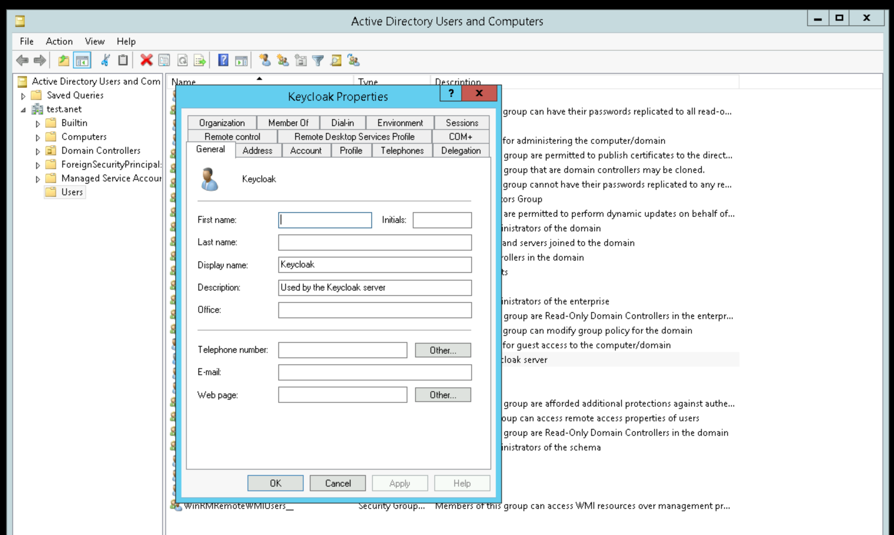
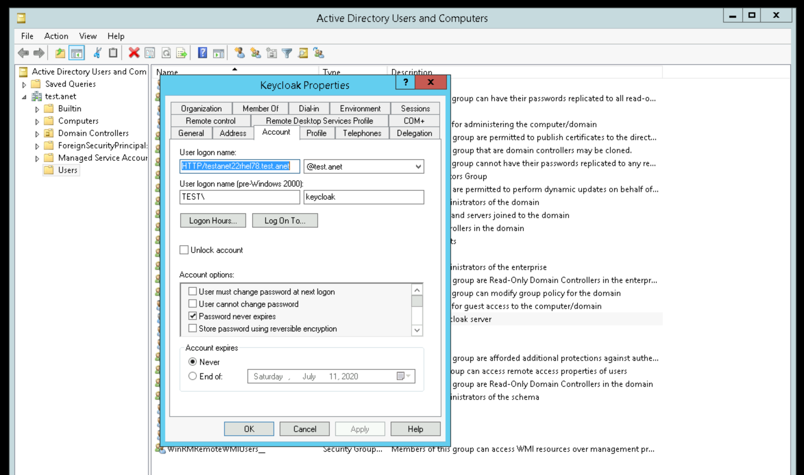
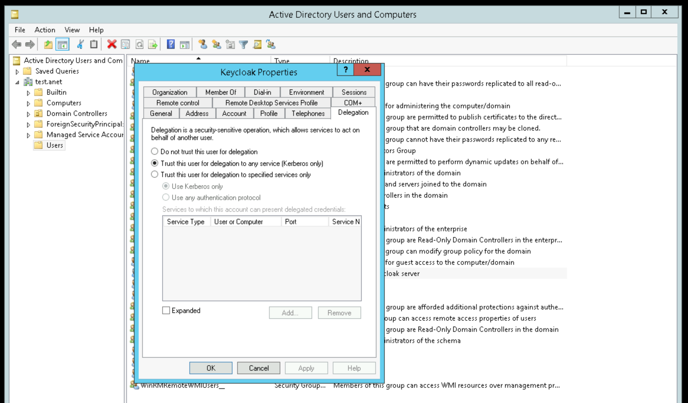
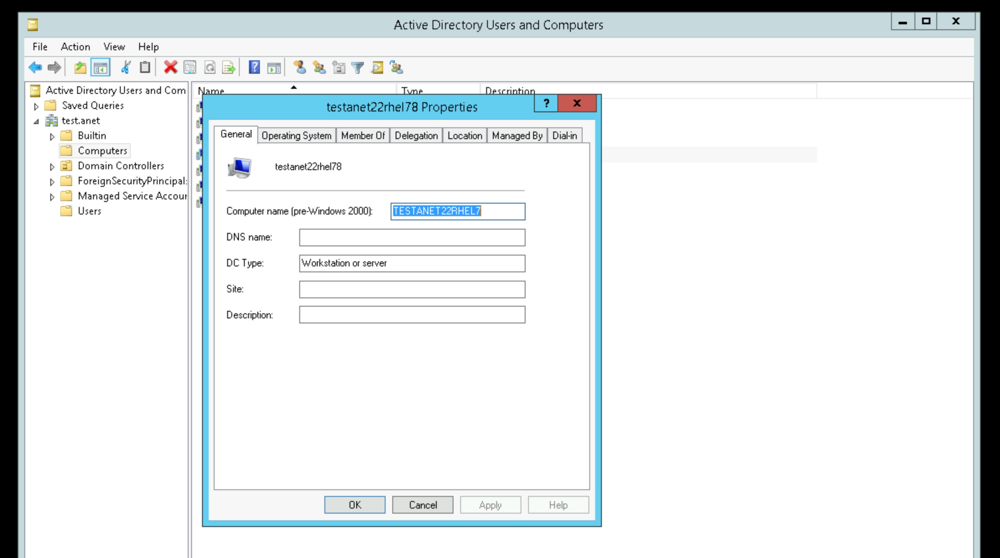
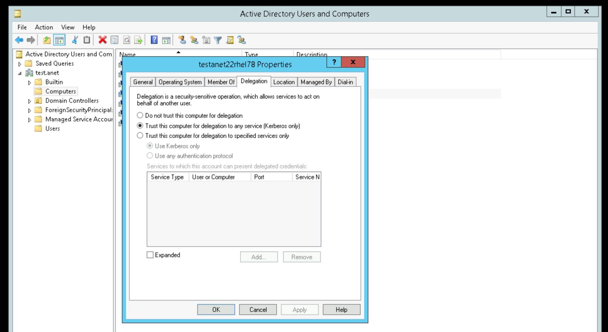
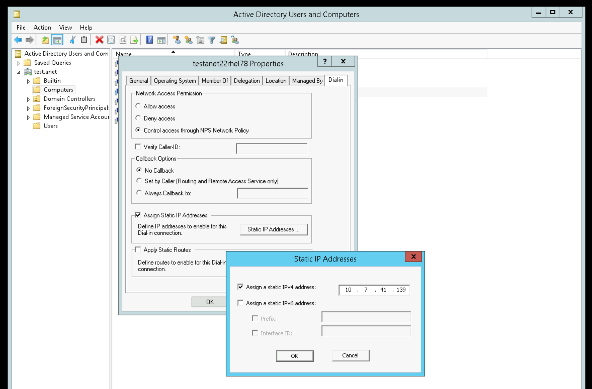
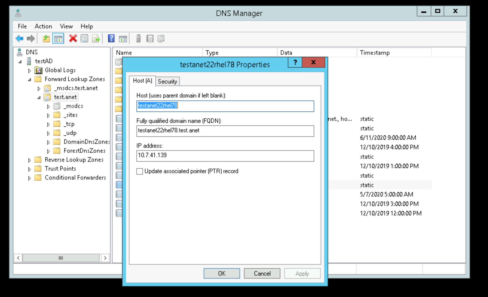

# Setting up Kerberos (for federated user authentication against a Windows Active Directory)
If you want to enable SSO/Single Sign-On for ANET users who have already authenticated against the Windows Active Directory, some steps need to be taken to set up Kerberos and integrate the Red Hat server running Keycloak.

## Create a user for Keycloak in the AD
Create a user named `keycloak` in the AD:




## Create a computer for the Keycloak server in the AD
Create a computer named `testanet22rhel78`:




## Add the computer to DNS in the AD
Add `testanet22rhel78.test.anet` to DNS:


## Create a Kerberos keytab on the AD server
On the AD server, create a keytab for Keycloak with:
```
  C:\Users\anetAdmin> ktpass -out keycloak.keytab -princ HTTP/testanet22rhel78.test.anet@test.anet -mapUser keycloak@test.anet -pass <password> -kvno 1 -ptype KRB5_NT_PRINCIPAL -crypto RC4-HMAC-NT
  Targeting domain controller: testAD.test.anet
  Using legacy password setting method
  Successfully mapped HTTP/testanet22rhel78.test.anet to keycloak.
  Key created.
  Output keytab to keycloak.keytab:
  Keytab version: 0x502
  keysize 76 HTTP/testanet22rhel78.test.anet@test.anet ptype 1 (KRB5_NT_PRINCIPAL) vno 1 etype 0x17 (RC4-HMAC) keylength 16 (0x9a967839920ff6e76852dc8299787377)

  C:\Users\anetAdmin> setspn -L keycloak
  Registered ServicePrincipalNames for CN=Keycloak,CN=Users,DC=test,DC=anet:
          HTTP/testanet22rhel78.test.anet

  C:\Users\anetAdmin> setspn -Q HTTP/testanet22rhel78.test.anet
  Checking domain DC=test,DC=anet
  CN=Keycloak,CN=Users,DC=test,DC=anet
          HTTP/testanet22rhel78.test.anet

  Existing SPN found!
```
Note that the option `-crypto RC4-HMAC-NT` is necessary to avoid Keycloak errors (`Cannot find key of appropriate type to decrypt AP REP - RC4 with HMAC`).

When done, copy `keycloak.keytab` to the Keycloak server (`testanet22rhel78`).

## Set up Kerberos on the Keycloak server
Install the required packages:
```
  [root@testanet22rhel78 ~]# yum install krb5-workstation
```
And configure Kerberos:
```
  [root@testanet22rhel78 ~]# cat /etc/krb5.conf
  # Configuration snippets may be placed in this directory as well
  includedir /etc/krb5.conf.d/

  [logging]
   default = FILE:/var/log/krb5libs.log
   kdc = FILE:/var/log/krb5kdc.log
   admin_server = FILE:/var/log/kadmind.log

  [libdefaults]
   dns_lookup_realm = false
   ticket_lifetime = 24h
   renew_lifetime = 7d
   forwardable = true
   rdns = false
   pkinit_anchors = FILE:/etc/pki/tls/certs/ca-bundle.crt
  # default_realm = EXAMPLE.COM
   default_realm = TEST.ANET
   default_ccache_name = KEYRING:persistent:%{uid}

  [realms]
  # EXAMPLE.COM = {
  #  kdc = kerberos.example.com
  #  admin_server = kerberos.example.com
  # }
   TEST.ANET = {
    kdc = testad.test.anet
    admin_server = testad.test.anet
    default_domain = test.anet
   }

  [domain_realm]
  # .example.com = EXAMPLE.COM
  # example.com = EXAMPLE.COM
   test.anet = TEST.ANET
   .test.anet = TEST.ANET
```

## Check DNS on the Keycloak server
Check that you can resolve your hostnames from DNS on the Keycloak server:
```
  [root@testanet22rhel78 ~]# dig testad.test.anet
  [root@testanet22rhel78 ~]# dig testanet22rhel78.test.anet
```

## Set up the Keycloak realm on the Keycloak server
Create a [Keycloak realm with LDAP/Kerberos federation](keycloak.md#ad), using the copied keytab (check ownership/permissions!). See [Keycloak documentation](https://www.keycloak.org/docs/latest/server_admin/index.html#_kerberos) for additional guidance.

## Configure ANET
Add the correct `keycloak-configuration` to `application.yml`.

## Configure browsers
Log on as an AD user on your client computer, then set up Internet Options (for Internet Explorer, Edge and Chrome) and Firefox (about:config) according to e.g. [these instructions](https://active-directory-wp.com/docs/Networking/Single_Sign_On/Configure_browsers_to_use_Kerberos.html).

Finally, open ANET in your browser ( https://testanet22rhel78.test.anet/ ) and you should be transparently logged in to ANET as the log-on user. 
