# Setting up Keycloak (user authentication)
This document describes how to configure Keycloak, for [development](#dev), [production](#rh) on a Red Hat platform, and [production with federated users from a Windows Active Directory](#ad).
On development, Keycloak runs in a Docker container, see [build.gradle](../build.gradle) for the available commands. For production, the directory [scripts](../scripts/) contains some convenient scripts for starting Keycloak.

## Setting up Keycloak for development
The Keycloak container for development has the following set-up (as loaded upon creation of the Keycloak Docker container by loading [ANET-Realm-export.json](../keycloak/import/ANET-realm.json)):

To access the container

### Access Keycloak container

|          |                        |
|----------|------------------------|
| URL      | http://localhost:9080/ |
| username | `admin`                |
| password | `admin`                |

### Realm definition
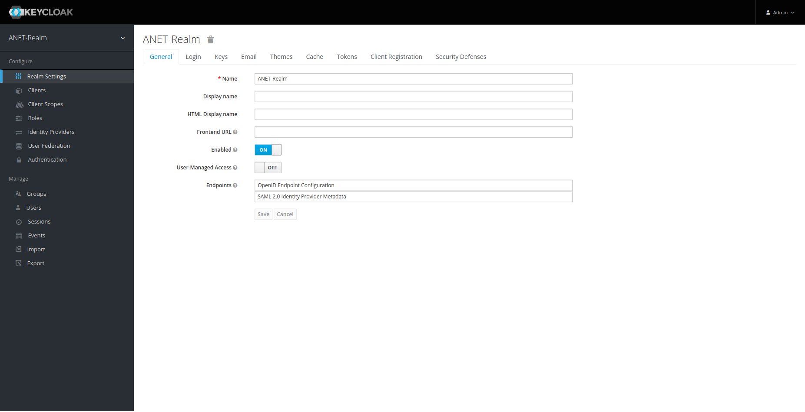

### Confidential client definition (used by the server-side)
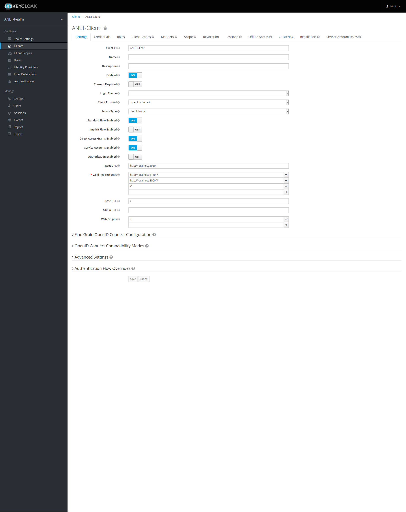

The credentials (to be used in [anet.yml](../anet.yml)):
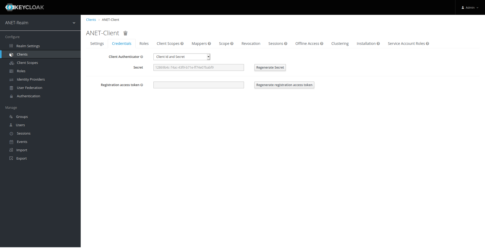

### Public client definition (used by the client-side)
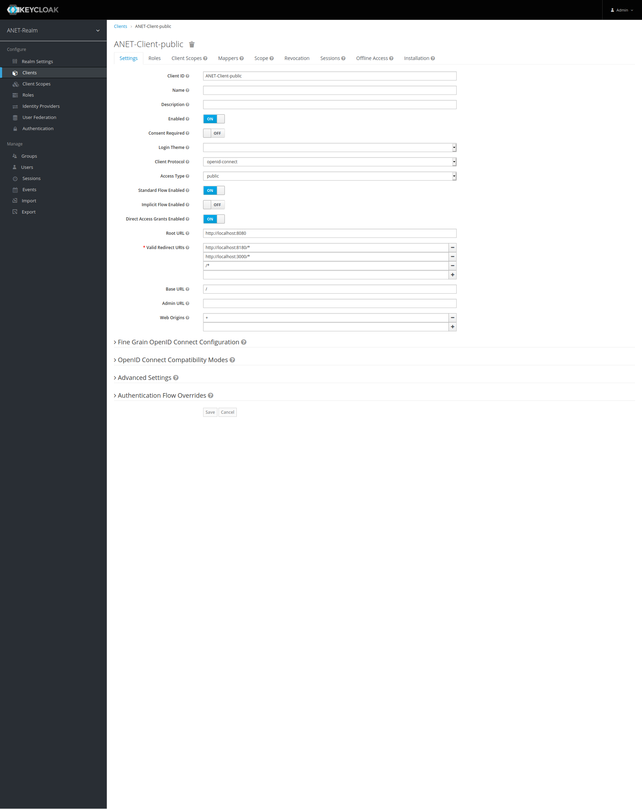

### Authentication settings of the realm
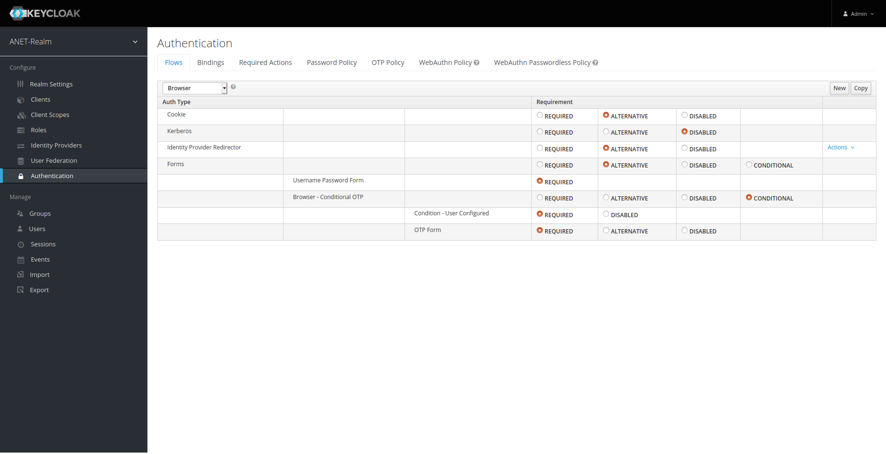

### Users defined locally in the realm
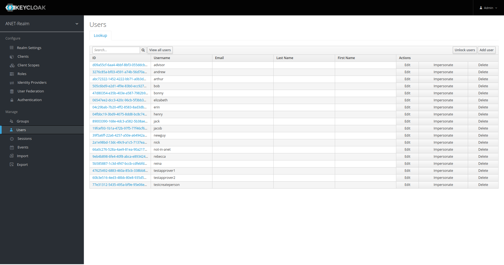

## Setting up Keycloak for production on Red Hat
A Keycloak container running on e.g. a Red Hat platform (where you would define the users locally in Keycloak) can use the following set-up:

### Realm definition

### Confidential client definition (used by the server-side)
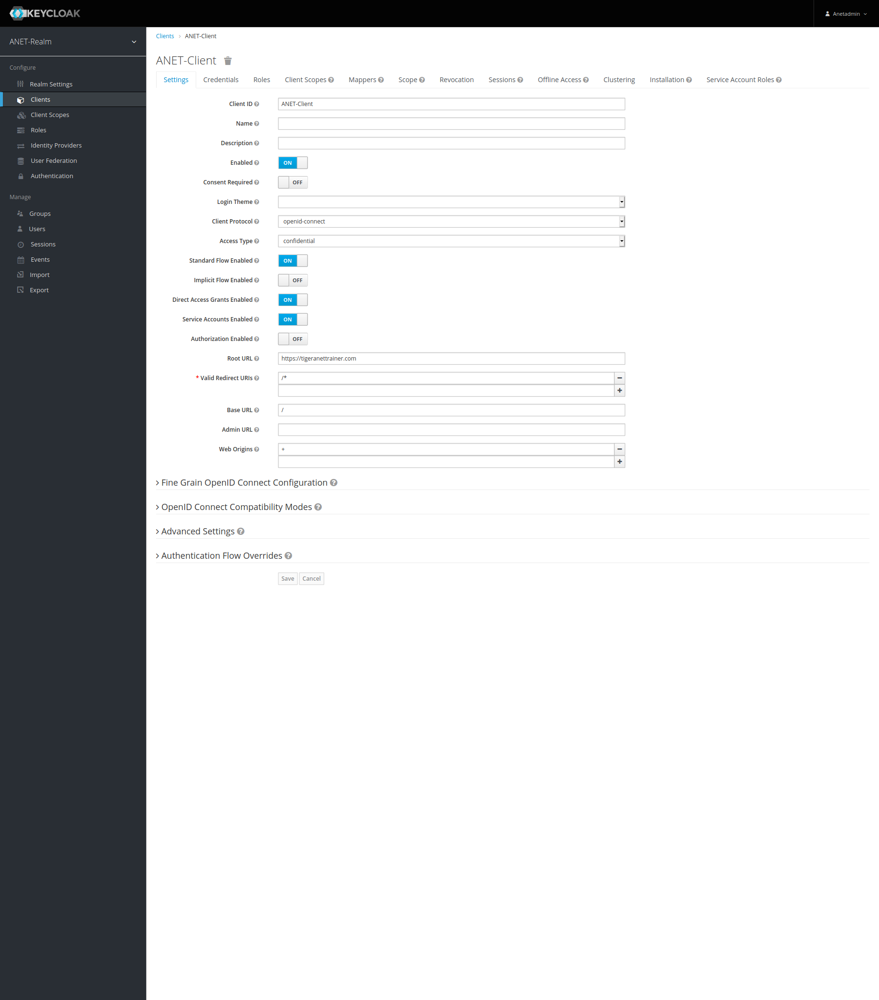

The credentials to be used in `anet.yml` can be found under the **Credentials** tab.

### Public client definition (used by the client-side)

### Authentication settings of the realm
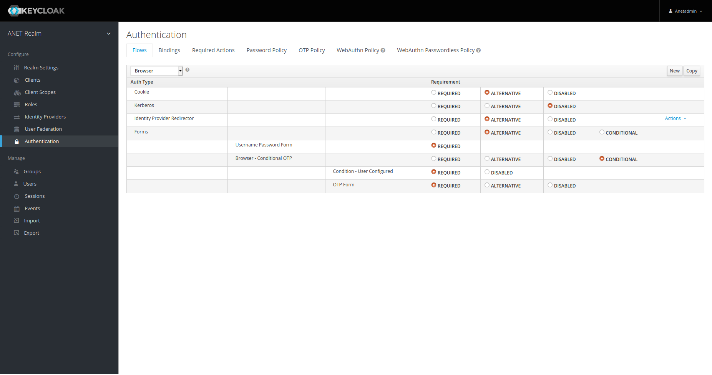

### Users defined locally in the realm
Define your users under the **Users** section of the realm.

## Setting up Keycloak for with federated users from a Windows Active Directory
See [Kerberos set-up](kerberos.md) on how to integrate the Keycloak server with the AD.

A Keycloak container running on e.g. a Red Hat platform that gets its users from a Windows Active Directory (and can support SSO/Single Sign-On) can use the following set-up:

### Realm definition
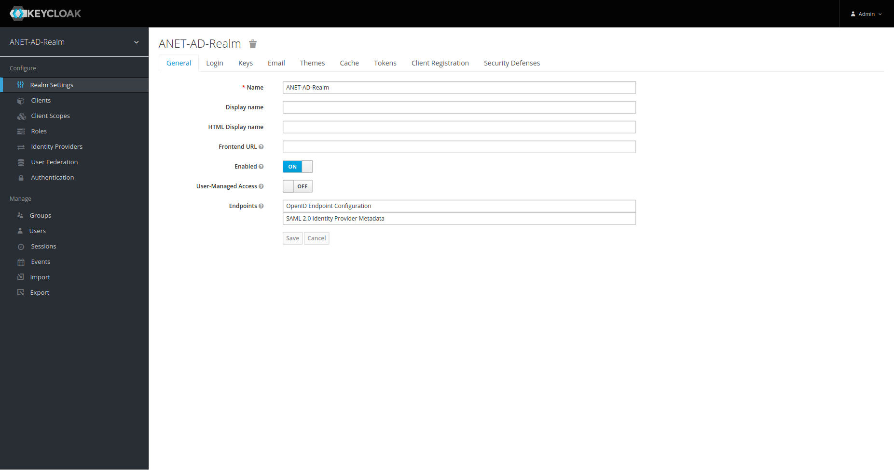

### Mapping first name from AD to the realm
To get newly on-boarded user's first names correctly mapped from AD to the realm, you may want to add a mapper **first name** to the realm:
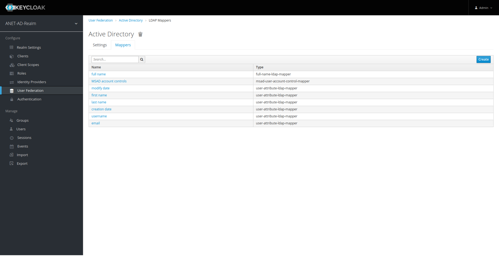
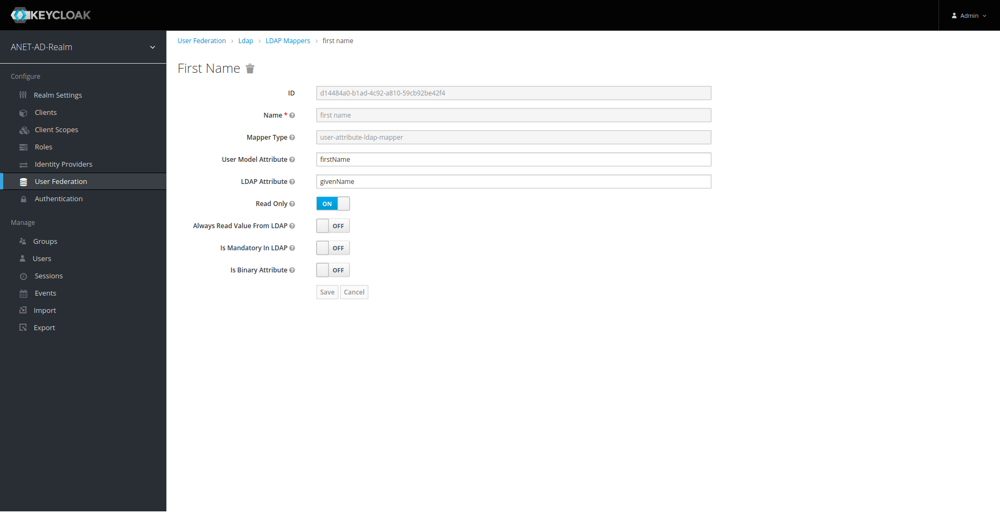

### Confidential client definition (used by the server-side)
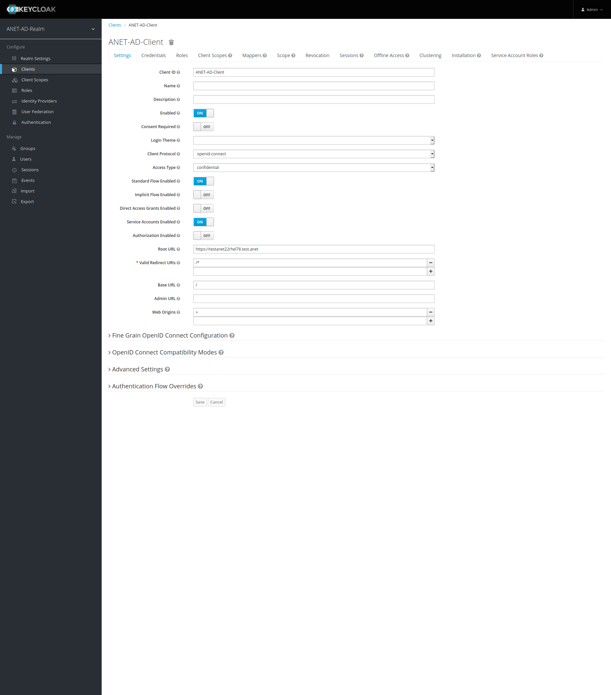

The credentials to be used in `anet.yml` can be found under the **Credentials** tab.

### Public client definition (used by the client-side)

### User federation settings of the realm
This is an example configuration to connect to an Active Directory; see [Keycloak documentation](https://www.keycloak.org/docs/latest/server_admin/index.html#_ldap) for additional hints on how to configure it:
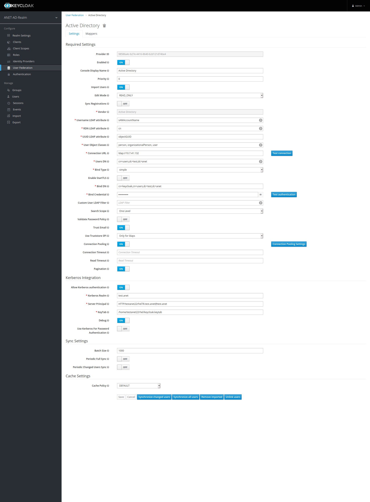

### Authentication settings of the realm
Take note of the *Kerberos* setting here (necessary if you want to support SSO):

